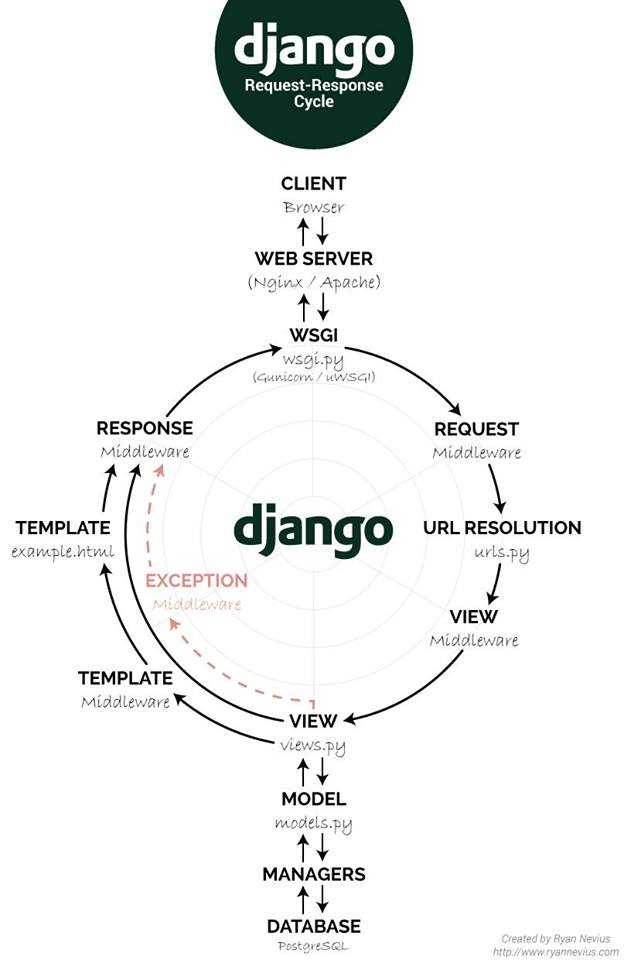

# Django


# 구성
- [Views - HTML이 어떻게 작용할지 입력하는 함수](./Django/Views/README.md)
- [URL - 특정 URL 입력시 HTML 연결](./Django/Urls/README.md)
- [Setting](./Django/Setting/README.md)
- [Models](./Django/Models/README.md)
- [Static](./Django/Static/README.md)

## Project 시작
- Project 만들기
    - django-admin startproject <project Name>
- Server 실행
    - python3 manage.py runserver <port Num>
- App 만들기
    - python3 manage.py startapp <app Name>
- DB
    - python3 manage.py makemigrations <app Name>
    - python3 manage.py migrate
- Admin
    - python3 manage.py createsuperuser


## 가상환경 vevn
- 가상환경 설치
```cmd
python3 -m vevn <vevn_name>
```
- 가상환경 실행
```cmd
source activate <vevn_name>
```
- 가상환경 종료
```cmd
deactivate
```

## Project의 구성
- Project
    - __pycache__
    - __init__.py
    - wsgi.py
    - setting.py
    - url.py

## APP(Project 구성 단위)의 구성
- APP
    - migration
    - templates (직접생성)
    - __init__.py
    - admin.py
    - apps.py
    - models.py
    - test.py
    - views.py

## 템플릿 언어
- Django에서 HTML문법 안에서 Python코드가 돌아갈 수 있게 해주는 문법
- 템플릿 변수
    - {{ Python-Variable }} : Python_Variable을 HTML화면에 출력해라
- 템플릿 필터
    - {{ Python-Variable | filter }}
    - Ex. {{ Value | length }} : Value의 길이 반환
    - Ex. {{ Value | lower }} : Value를 소문자로 출력
- 템플릿 태그
    - HTML상 Python문법 사용, URL생성 등의 기능 제공
    -  ... tag 내용 ... 
- EX_1
```python
# Python File
Aclass = ["a", "b", "c"]

# HTML FIle
num = {{ class | length }}

    {{i}}
    {{i.date | date:"Y-m-d"}}
{}
```
- EX_2
```HTML
<!--  -->

<a href = "">home 으로 돌아가기</a>
```
## HTML상의 입력한 Data 추출하기
- HTML 상의 예제 코드
```HTML
<!-- 현재위치 : home.html -->

<!-- input을 누를시 form action에 해당하는 곳으로 정보를 보낸다. -->
<form action = "">
    <textarea cols = "50" rows = "10" name = "fulltext"></textarea>
    <br>
    <input type = "submit" value = "Count!">
</form>
```
- 위 HTML 코드에 대응하는 Python(views) 코드
```python
def result(request):
    text = request.GET['fulltext'] # HTML에서 name이 fulltext인 요소를 가져와라
    word = text.split()
    return render(requset, "result.html", {"full" : text, "word_len" : len(word)}) # 가져온 요소를 result.html에 띄워주기 위해 render 마지막에 딕셔너리 형태로 넘겨준다 (Key 값은 자신이 정해주는 이름이다)
```
- views에서 작업한 요소 html상에 띄워주기
```html
<h2>입력한 텍스트는 아래와 같습니다</h2>
{{full}}
<h2>입력한 문자의 길이는 아래와 같습니다</h2>
{{word_len}}
```

## Base.html 만들기
- 1. Project폴더 내 Templates폴더 생성
- 2. base.html 생성 후 setting.py에 알리기

- setting.py
```python
TEMPLATES = [
    {
        'BACKEND': 'django.template.backends.django.DjangoTemplates',
        'DIRS': ['Project/templates'], # 해당 부분에 base.html에 존재 알려주기
        'APP_DIRS': True,
        'OPTIONS': {
            'context_processors': [
                'django.template.context_processors.debug',
                'django.template.context_processors.request',
                'django.contrib.auth.context_processors.auth',
                'django.contrib.messages.context_processors.messages',
            ],
        },
    },
]
```
- base.html
```html

<!-- html code -->





<!-- html code -->
```
- home.html
```html



<!-- html code -->

```

## GET, POST, PUT, DELETE
- GET : 데이터 조회
- POST : 데이터 생성
- PUT : 데이터 수정
- DELETE : 데이터 삭제

## a Tag
```html
<style>
    
    a:link { color: black; } /* 방문 전 */
    a.class:visited { color: green; } /* 방문 후 */
    a#id:hover { color: blue; } /* 마우스 오버 */
    a:active { color: red; } /* 클릭 */

</style>
```